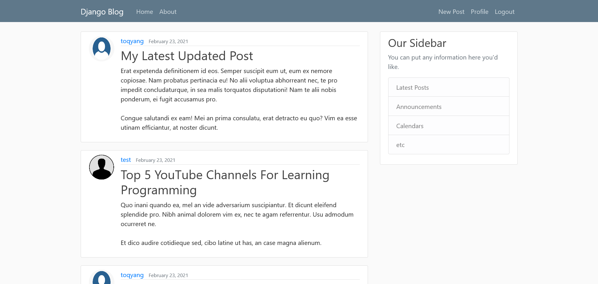
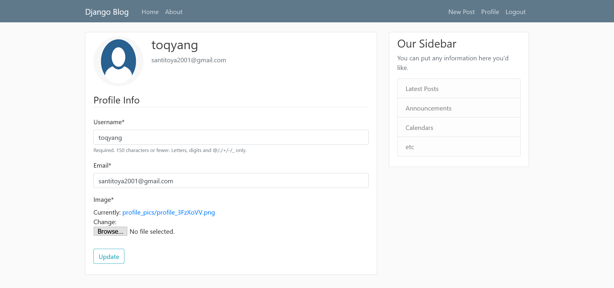
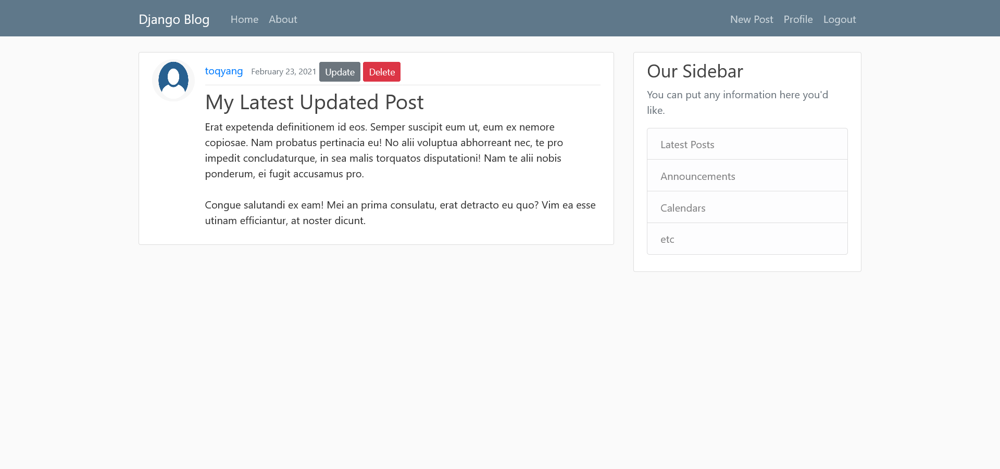

# Blog Django

- Implement Crud in Django through a Blog

## Prerequisites

- You have to use Django(3.1)
- Jinja2
- HTML, CSS

## Preview

  
  
  

## Install

python3.7 -m pip install -r requirements.txt

## Contributing

-- Santiago Yanguas

## Versioning

For my learning of web dev

## Authors

---Santiago Yanguas

## Files

| Files              | Description     |
| ------------------ | --------------- |
| **blog**           | Blog Side       |
| **db.sqlite3**     | DataBase        |
| **django_project** | General Project |
| **manage.py**      | Django Handle   |
| **media**          | Picture         |
| **posts.json**     | Initial Posts   |
| **users**          | Users side      |
